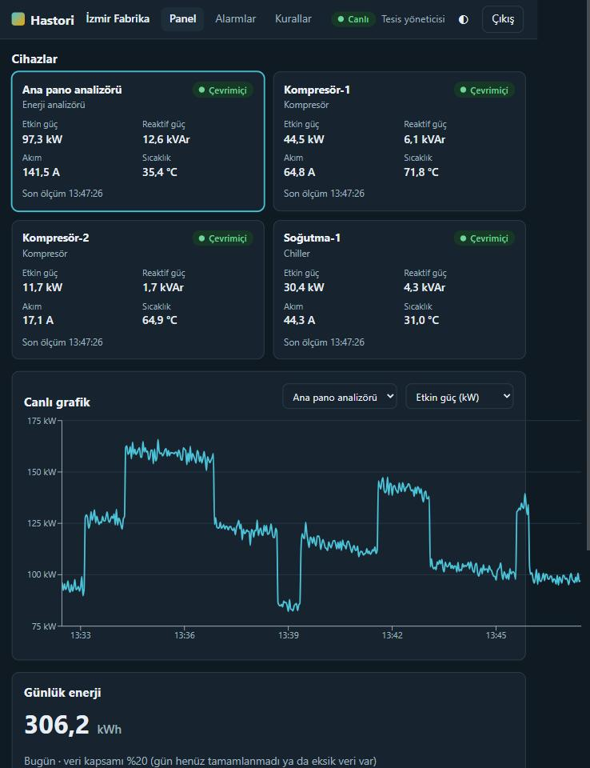
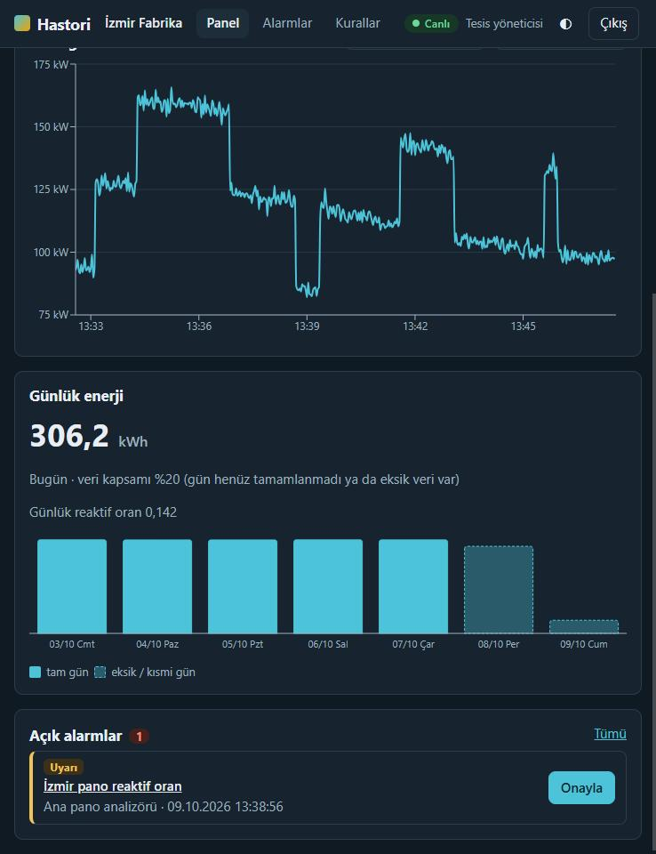
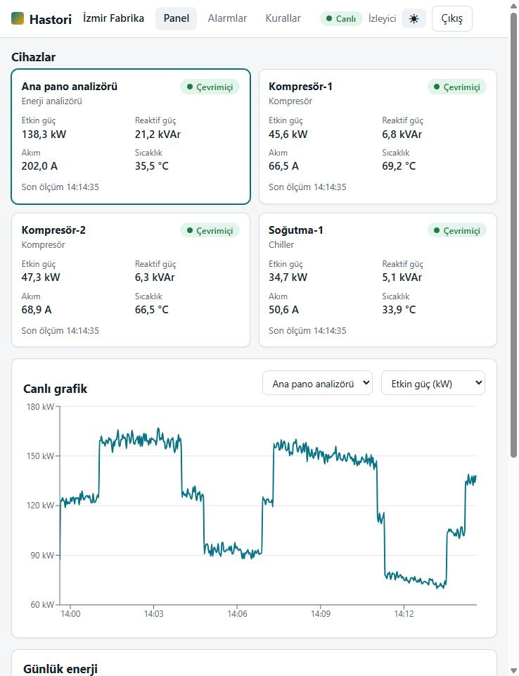
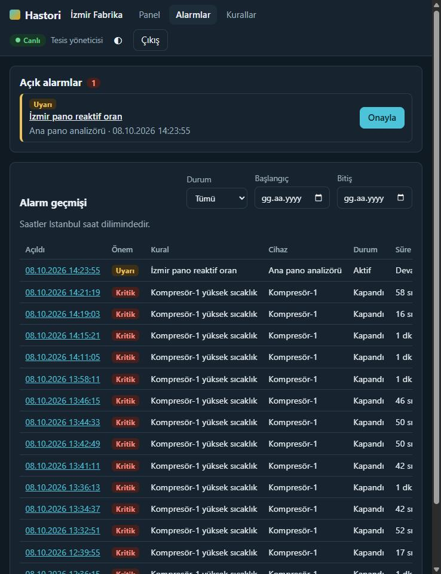
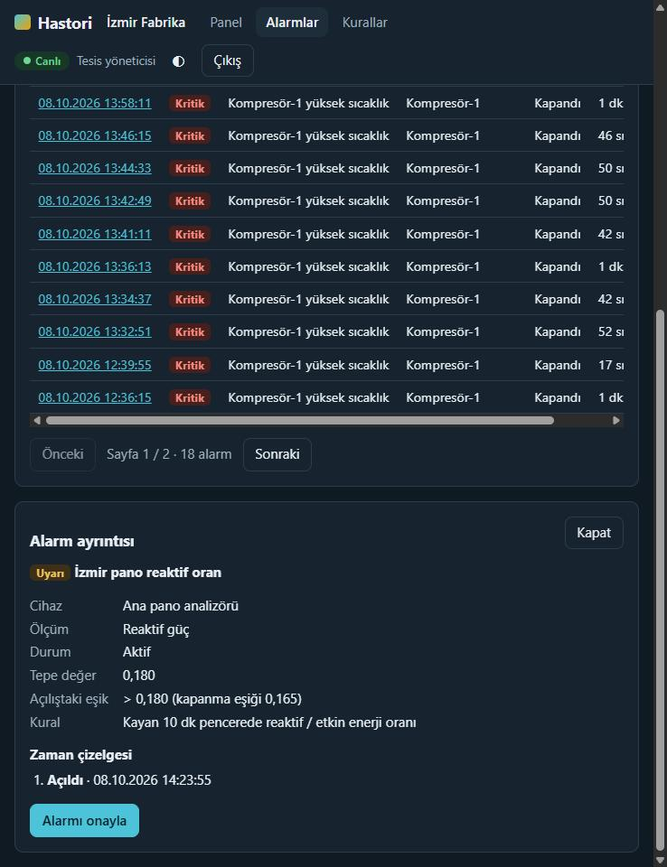

# Hastori

Industrial telemetry platform. A simulator publishes measurements from 7 devices every 2 seconds
over MQTT (TLS + per-device ACL) to an ingestion service, which writes them to TimescaleDB and
publishes them to RabbitMQ. An alarm service evaluates rules on that stream (hysteresis, duration,
reactive-energy ratio, silent devices) and a REST API (JWT, three roles, strict per-site isolation) serves
devices, time series, daily consumption, alarms and rule management. A Next.js dashboard (Turkish
interface, light and dark) shows the devices, a live chart, the daily energy and the alarms, and
updates over a WebSocket without a page refresh.

```
simulator --MQTT 5, QoS 1, TLS--> mosquitto --$share--> ingestion --+--> TimescaleDB (measurements + outbox)
 (7 devices, own credentials)                                       |
                                                                    +--> outbox relay --> RabbitMQ hastori.telemetry
                                                                                                 |
                                     alarm.telemetry (one active consumer, dead-letter queue) <-+
                                                 |
                                                 v
                          alarm service --alarms--> TimescaleDB <--reads (tenant-scoped)-- API (FastAPI, JWT)
                                 |                                                              |
                                 +----------- alarm.opened / .cleared --> Redis <---- sessions, login limit, .acknowledged
                                                                            ^
 ingestion ---- measurement events after the commit -----------------------+
                                                                            | one PSUBSCRIBE per API process
 browser <--HTTP + WebSocket-- Caddy :8080 --/api/*--> API (REST, /ws hub) -+
                                        \--the rest--> Next.js (web)
```

`seed/demo.yaml` is the single source of truth: the database seed, the Mosquitto password/ACL
files and the simulator device list are all generated from it.

## Hızlı başlangıç

Requirements: Docker + Compose, [uv](https://docs.astral.sh/uv/), Git. `make` is optional on
Windows (`winget install ezwinports.make`); PowerShell equivalents are below.

```bash
git clone <repo-url> hastori && cd hastori
make up          # .env with random secrets, TLS certs, MQTT users/ACL, then timescaledb + mosquitto + rabbitmq + redis + migrate + ingestion + alarm + api + web + caddy (http://127.0.0.1:8080)
make seed        # demo org, 2 sites, 7 devices, 5 users, 5 alarm rules (idempotent)
make backfill    # 7 days of synthetic history, so the energy card is not empty (see "Demo data")
make simulate    # start the field simulator
make smoke       # automated day-1 checks
make web-install && make web-dev   # optional: the dashboard with hot reload on http://127.0.0.1:3000 (needs Node 24)
make e2e         # automated day-2 checks: authorization matrix, alarm lifecycle, restart, dead letters (about 15 minutes)
make fault DEVICE=izmir-komp-1 KIND=overheat   # trigger an overheat: a critical alarm opens after 30 s
```

Then open the dashboard at <http://127.0.0.1:8080> and sign in as one of the demo users below.
Swagger is at <http://127.0.0.1:8000/api/v1/docs> (`POST /auth/login`, *Authorize*, paste the
`access_token`).

Demo logins (seeded): `admin@demo.hastori.local` (system admin), `izmir.admin@demo.hastori.local`
and `antalya.admin@demo.hastori.local` (site admins), `izmir.izleyici@demo.hastori.local` and
`antalya.izleyici@demo.hastori.local` (viewers; two sites make the tenant isolation visible);
passwords are the `SEED_*` values in `.env` (`admin_demo_pw`, `siteadmin_demo_pw`,
`viewer_demo_pw` by default). All other secrets in `.env` are generated randomly by `make env`.
The sign-in page also has two buttons, "İzleyici olarak gir" and "Tesis yöneticisi olarak gir",
that need no password (`DEMO_LOGIN=true`, on in `.env.example`, off unless set in compose: see
"Demo data and demo sign-in"). **Those three passwords are public.** Never expose the stack beyond `127.0.0.1` (Cloudflare Tunnel, a
public server) without `make env-public` first.

Services refuse to start with a published demo value in a secret they use
(`ALLOW_DEMO_SECRETS=1` overrides this for throwaway runs). Each container receives only the
variables it needs, runs as an unprivileged user with a read-only root filesystem, no
capabilities and a memory limit.

**Upgrading from an earlier checkout:**

- Day 1 -> day 2: `make env` adds the new keys (`REDIS_PASSWORD`, `JWT_SECRET`, ...) to your
  `.env` without touching the existing ones. The alarm queue now has more arguments (dead-letter
  exchange, single active consumer) and RabbitMQ refuses to redeclare an existing queue with
  different ones, so run `make reset-alarm-queue` once, then `make up` again. Raw measurements are
  in the database; the alarm service replays the last minutes from there when it starts.
- The MQTT session id changed on day 1 (see below). Run
  `docker compose --profile sim down`, `docker volume rm hastori_mosquitto-data`, then `make up`;
  otherwise the old session `ingestion-1` stays in the shared-subscription group and the broker
  keeps handing it half of the messages until it expires.

| make target      | PowerShell equivalent |
|------------------|-----------------------|
| `make env`       | `uv run python scripts/gen_env.py` (never overwrites an existing `.env`; only appends keys added to `.env.example`; refuses to create a new one while old data volumes exist; also writes `infra/redis/redis.pw`) |
| `make env-public`| `uv run python scripts/gen_env.py --public` (also random demo-user passwords, printed once: use it before exposing the demo on the internet) |
| `make certs`     | `uv run python scripts/gen_certs.py` (renews the server certificate when < 30 days are left) |
| `make mqtt-auth` | `uv run python scripts/gen_mqtt_auth.py` |
| `make up`        | env + certs + mqtt-auth above, then `docker compose up -d --build --wait` |
| `make down`      | `docker compose --profile sim down` |
| `make logs`      | `docker compose --profile sim logs -f --tail=100` |
| `make migrate`   | `docker compose run --rm migrate` |
| `make seed`      | `uv run python scripts/seed.py` |
| `make seed-reset`| `uv run python scripts/seed.py --reset` (YAML wins: re-hash passwords, restore rules) |
| `make backfill`  | `uv run python scripts/backfill.py --days 7` (`DAYS=3 make backfill`): synthetic history |
| `make simulate`  | `docker compose --profile sim up -d --build simulator` |
| `make fault`     | `uv run python scripts/fault.py izmir-komp-1 overheat 120` |
| `make smoke`     | `uv run python scripts/smoke.py` |
| `make smoke-quick` | `uv run python scripts/smoke.py --no-fault` |
| `make resilience`| `uv run python scripts/resilience.py` (about 30 minutes; `--quick` skips the 6 minute ingestion outage, `--alarm-only` runs just the alarm service drills) |
| `make e2e`       | `uv run python scripts/e2e.py` (about 25 minutes; `--skip-reactive`, `--skip-restart`) |
| `make web-install`, `make web-dev` | `cd web; npm ci` once, then `npm run dev` (dashboard on `http://127.0.0.1:3000`, `/api` is forwarded to the API on 8000, the WebSocket goes to 8000 directly) |
| `make web-check` | `cd web; npm run typecheck; npm run lint; npm test` |
| `make reset-alarm-queue` | `uv run python scripts/reset_alarm_queue.py` (then `docker compose restart ingestion alarm`) |
| `make test`      | `uv run pytest` |
| `make lint`      | `uv run ruff check .; uv run ruff format --check .; uv run mypy packages services scripts tests conftest.py` |

Fault kinds: `overheat`, `spike`, `compensation_failure`, `offline`.
The default fault lasts 120 s: the overheat crosses 80 °C after 8-18 s, the demo alarm rule
(`seed/demo.yaml`) wants 30 s above it, and the alarm then stays open for over a minute so it
can be acknowledged; a unit test (`test_demo_scenario.py`) keeps the simulator and the rules in
step. `make smoke` injects a real overheat into `izmir-komp-1` and clears it as soon as 80 °C was
seen; use `make smoke-quick` whenever alarms are being tested. `compensation_failure` on
`izmir-pano` raises the reactive-ratio warning after about two minutes.

### Endpoints (all bound to 127.0.0.1)

| Service | URL |
|---------|-----|
| **Dashboard** (Caddy: pages, REST and WebSocket on one origin) | `http://127.0.0.1:8080` |
| REST API, Swagger | `http://127.0.0.1:8000/api/v1`, `/api/v1/docs`, `/api/v1/openapi.json`; `/healthz`, `/readyz`, `/metrics` |
| **Grafana** (dashboard "Hastori pipeline") | `http://127.0.0.1:3001` (user `admin`, `GRAFANA_ADMIN_PASSWORD` in `.env`) |
| Prometheus (targets, alert rules) | `http://127.0.0.1:9090` (`/targets`, `/alerts`) |
| Alarm service health / readiness / metrics | `http://127.0.0.1:8003/healthz`, `/readyz`, `/metrics` |
| Ingestion health / readiness / metrics | `http://127.0.0.1:8001/healthz`, `/readyz`, `/metrics` |
| Simulator fault control | `http://127.0.0.1:8002/faults` (`Authorization: Bearer $SIM_CONTROL_TOKEN`) |
| RabbitMQ management | `http://127.0.0.1:15672` (credentials in `.env`) |
| TimescaleDB | `127.0.0.1:5432` |
| Redis | `127.0.0.1:6379` (password in `.env`) |
| MQTT (TLS only) | `127.0.0.1:8883` (CA: `infra/mosquitto/certs/ca.crt`) |

The ingestion and alarm endpoints, `/metrics` of the API and Prometheus have no authentication;
they only expose counters and readiness. Grafana and Prometheus see every site: they are never
routed through Caddy, reach them over SSH on a remote machine. Do not widen the `127.0.0.1` port bindings: put Caddy (8080) in front and, for the
internet, a tunnel (see "Putting it on the internet" under Known limits).

### The API

| | |
|---|---|
| `POST /auth/login`, `/auth/refresh`, `/auth/logout`, `GET /auth/me` | access token (15 min, in the body) + rotating refresh token (7 days, httpOnly cookie) |
| `POST /auth/password`, `GET`/`POST /auth/demo` | change your own password (ends your other sessions); is the passwordless demo sign-in on, and sign in as the demo viewer or site admin |
| `GET /sites`, `POST`/`PATCH /sites` | sites you can see; create and change (system admin) |
| `GET /sites/{id}/devices` | devices with their latest value per metric and an `online` flag |
| `GET /devices/{id}/measurements?metric=&from=&to=&interval=` | raw, 1 minute or 1 hour points (`auto` picks); at most 5000 points and 90 days |
| `GET /sites/{id}/consumption/daily?days=` | kWh per day of the site's time zone, with the share of minutes that have data |
| `GET /alarms`, `GET /alarms/{id}`, `POST /alarms/{id}/ack` | history, one alarm with its timeline, acknowledge |
| `GET`/`POST`/`PUT`/`DELETE /alarm-rules` | rule management (site admins for their sites); `DELETE` disables |
| `GET`/`POST /users`, `GET`/`PATCH /users/{id}` | user management (system admin); `PATCH` takes role, sites, password and `is_active` |
| `POST /ws-ticket`, `GET /ws?ticket=` (WebSocket) | live measurements and alarm events of one site at a time (see "Dashboard (day 3)") |

A user sees only the sites assigned to them (a system admin sees all sites of the organisation).
An object of another site answers **404**, a role that may not do something **403**, a missing or
bad token **401**; a backing service that is down is a **503**. Every error has the same shape,
`{"error": {"code": "...", "message": "..."}}`.

## Design notes

Decision records: [TimescaleDB over InfluxDB](docs/adr/0001-timescaledb-over-influxdb.md), [RabbitMQ over Kafka](docs/adr/0002-rabbitmq-over-kafka.md), [WebSocket over SSE](docs/adr/0003-websocket-over-sse.md); open risks are in [docs/design-risks.md](docs/design-risks.md).

### Ingestion (day 1)

- **Delivery**: a message is acked to the broker (MQTT 5 manual ack) only after its database
  transaction committed. After a crash or restart the broker redelivers it, and the unique index
  on `(device_id, metric, time)` plus `ON CONFLICT DO NOTHING` absorb the duplicate.
- **Outbox**: the RabbitMQ event is inserted into an `outbox` table in the same transaction as the
  measurements; a relay publishes it with publisher confirms and then deletes it. An event cannot
  fall between "committed" and "published". Events older than 1 hour are dropped and counted
  (`ingest_outbox_expired_total`); `ingest_outbox_depth` shows the backlog.
- **Poison messages**: only errors that are a property of the data (SQLSTATE class 22 data
  exception, class 23 integrity violation, e.g. a foreign key) switch a batch to row-by-row
  commits so that only the offending message is dropped (`reason="db_rejected"`). Every other
  database error (connection, restart, failover, a missing table after a bad migration, a wrong
  password) is retried with backoff and nothing is acked meanwhile: an outage must never turn
  into silent data loss. The payload parser raises `Rejected` for any input, however hostile
  (huge numbers, deep nesting, oversized, binary), so one bad message cannot kill the connection
  and be redelivered forever.
- **Liveness**: the loops (writer, relay, subscriber, device cache, HTTP) are watched. If one
  dies the process logs it, exits non-zero and the restart policy takes over; `/healthz` returns
  503 meanwhile. `/readyz` reports MQTT, database and RabbitMQ (the latter really reflects a lost
  broker connection).
- **Outbox relay**: publishes with a timeout and holds no database transaction while talking to
  RabbitMQ, so a broker under a memory/disk alarm cannot pin a connection or block vacuum.
- **Durable queue**: ingestion declares `alarm.telemetry` (bound to `telemetry.#`, bounded to
  200 000 messages / 1 h, dead-lettering into `hastori.dlx` -> `alarm.telemetry.dlq`) next to the
  exchange, because a topic exchange silently drops messages that have no bound queue. Ingestion
  and the alarm service declare it through the same function (`hastori_common.messaging`).
- **Restarts**: the ingestion MQTT session is persistent (`clean_start=False`, session expiry
  1 h). The broker keeps up to 200 000 messages for it, but only while the session lives, so an
  outage is survivable for **1 hour** (not "16 hours": that is how long the queue *could* grow).
  A replayed message may be up to that old; the parser accepts timestamps up to 65 minutes in the
  past (`MAX_AGE_S`), a test pins the two numbers together, and `make resilience` includes a
  6 minute outage. Mosquitto delivers up to 500 messages in flight (`max_inflight_messages`), so a
  backlog replays at hundreds of messages per second, not 20.
- **MQTT identity**: `use_username_as_clientid` makes the MQTT user the client id. Without it any
  authenticated device could connect as `ingestion` and take over its session, discarding the
  queued messages (upstream issue eclipse-mosquitto/mosquitto#3553, open). A second ingestion
  replica therefore needs its own MQTT user and ACL entry, and its own `INGEST_HTTP_PORT`; never
  use random ids with a shared subscription: the abandoned session stays in the group and the
  broker keeps handing it messages. `message_size_limit` is 4096 bytes, `max_connections` 200.
- **Shutdown**: SIGTERM stops reading, writes the queue out, acks and disconnects. If the
  database is down it gives up after `INGEST_SHUTDOWN_DEADLINE_S` (20 s) leaving the rest un-acked
  (redelivered later); compose allows 40 s.
- **Scaling**: shared subscription (`$share/ingestion/...`); a second replica splits the load
  (see "MQTT identity" for what it needs; the compose file runs one).
- **Device credentials** are not stored: `HMAC-SHA256(MQTT_DEVICE_SECRET, device_id)`.
  Changing `MQTT_DEVICE_SECRET` changes every device password: run `make mqtt-auth`, restart
  mosquitto and the simulator.
- **Devices are never deleted**: a trigger refuses `DELETE` on `devices` (history references
  them); set `is_active = false`. Ingestion refreshes its device cache on a Postgres
  `LISTEN/NOTIFY` message, so changes apply immediately.
- **Migrations**: `0001` is frozen DDL (it does not import the ORM models). Schema changes go in
  new migrations only; never edit an applied one (`0004` added alarm-rule checks and list-query
  indexes, `0005` rule kinds, the mandatory clear threshold and the site time zone). Each
  revision commits on its own, and `0002` is idempotent, so a failed run can simply be repeated.
  `alembic check` reports no drift between models and database.
- **TLS keys**: the CA private key lives in `infra/mosquitto/ca-private/` and is *not* mounted
  into the broker (only `ca.crt`, `server.crt`, `server.key` are). `make certs` is idempotent and
  renews the server certificate 30 days before it expires; run it before every `make up` (it is
  part of it) or from a scheduled task, then restart mosquitto.
- **Seed**: by default it never overwrites what people changed (users' e-mail, role and
  password hash, a site's name, city and time zone, a device's name and active flag, alarm rules);
  `make seed-reset` does.

### Observability (day 4)

- Prometheus scrapes ingestion, the alarm service, the API and RabbitMQ (its `rabbitmq_prometheus`
  plugin; per-queue depths from `/metrics/detailed`) every 15 s and keeps 7 days (at most 1 GB).
- The API exports `api_requests_total{method,route,status}`, `api_request_duration_seconds` and
  `api_ws_connections`. `route` is the template (`/api/v1/sites/{site_id}/devices`), never an id;
  probes and the scrape itself are not counted.
- Alert rules (`infra/prometheus/alerts.yml`): a service down, the whole fleet silent (the case
  `no_data` cannot see, risk G16), a backlog on `alarm.telemetry`, a growing dead-letter queue or
  rejected messages, evaluation lag over 10 s, an outbox backlog, ingestion rejecting, MQTT
  reconnect churn, API 5xx. There is no notification channel: firing alerts show in Prometheus and
  on the Grafana dashboard.
- Grafana is provisioned from `infra/grafana` (data source and the "Hastori pipeline" dashboard:
  flow, lag, open alarms, queues, API traffic and latency, WebSockets, firing alerts); anonymous
  access and sign-up are off.
- Request ids: Caddy makes one per request (never taken from the client), sends it to the API as
  `X-Request-ID`, writes it into its access log as `request_id` and returns it to the browser. The
  API logs every line of that request with the same `request_id` and echoes it, also on a 500.

### Demo data and demo sign-in (day 4)

- **Synthetic history.** `make backfill` writes 1 to 7 days (default 7) of one-minute readings
  from the simulator's own signal model (`hastori_simulator.signals`: the factory's shift, the
  hotel's evening peak), refreshes the one-minute aggregate for exactly that window and stops where
  real data starts. It never overwrites a row, injects no faults and opens no alarms. **The numbers
  on the energy card before the first real day are synthetic**, not measured. Raw data is kept 7
  days, so more is refused; the refresh always has both bounds (`NULL, NULL` would rebuild the
  aggregate from what raw data is left and delete older minutes, risk D1).
- **Demo sign-in.** With `DEMO_LOGIN=true`, `POST /auth/demo {"role": "viewer" | "site_admin"}` signs in
  as the one fixed Izmir viewer or Izmir site admin (`DEMO_VIEWER_EMAIL`, `DEMO_SITE_ADMIN_EMAIL`)
  and answers like `/auth/login`. The system admin cannot be asked for, the account must have
  the requested role (a wrong e-mail setting does not become a back door) and be active; with the
  setting off the endpoint is a 404. The gateway counts it with sign-in. A site admin can change
  rules: on a public demo run `make seed-reset` nightly (risk G17).
- **Sessions end when they should.** `users.token_version` goes up on a password change (your own or
  an admin's) and on deactivation (`PATCH /users/{id} {"is_active": false}`; not yourself, not the
  last active system admin). The access token carries the version and every request compares it,
  the refresh session keeps the version it was signed in under: both die at once, a deactivated
  user cannot sign in and gets the same 401 as a wrong password. `POST /auth/password` needs the
  current password and keeps the device it was called from signed in.
- **Who acknowledged.** `alarms.acked_by_label` stores the name at acknowledgement (the e-mail
  address before the `@`: users have no other name). The API and the screen show that, never the
  address, and it stays when the account is renamed. Migration `0009` fills it for old alarms.

### Dashboard (day 3)

| Dashboard (dark) | Daily energy and open alarm | Light theme |
|---|---|---|
|  |  |  |

| Alarms (site admin: acknowledge button) | Alarm detail |
|---|---|
|  |  |

Screenshots are of the packaged stack on `http://127.0.0.1:8080` at a narrow window, so the layout
is the single-column one; on a wide screen the chart, the daily energy and the open alarms sit side by side.

- **One origin.** In the packaged stack Caddy listens on `127.0.0.1:8080` and sends `/api/*` (REST
  and the WebSocket) to the API and everything else to the Next.js server, so the refresh cookie
  (`SameSite=Strict`, `Path=/api/v1/auth`) is first-party and the socket needs no CORS. With
  `make web-dev` the same job is done by a Next.js rewrite. Caddy's access log drops the
  WebSocket ticket from the query string (errors too). Caddy hands the API the real client address
  (`CF-Connecting-IP` / `X-Forwarded-For` from private proxy ranges; the API believes it only
  from `TRUSTED_PROXIES`).
- **What the gateway does** (`infra/caddy`, an image built with `xcaddy` and `mholt/caddy-ratelimit`):
  10 requests a minute per client address for sign-in and token refresh, 300 for the rest of
  `/api` (429 with `Retry-After`); a request body over 1 MB is refused (413); a `Host` that is not
  in `ALLOWED_HOSTS` gets 421; `/api` answers carry `Cache-Control: no-store`; `Strict-Transport-Security`
  is sent when the tunnel says the request came over HTTPS (`X-Forwarded-Proto`), and then the CSP lets
  the page open `wss:` only; open WebSockets get a minute to finish on a reload. TLS itself ends
  at the tunnel in front. The base images are pinned by digest.
- **Why Next.js, and how little of it is used.** It is the stack of the brief. Used: the App Router for layouts
  and the dynamic `/sites/[siteId]` routes, a server-rendered page skeleton, the standalone
  output for a small image, and `proxy.ts` for a per-request CSP nonce. Not used: Server Actions
  or server-side data fetching. The refresh cookie only travels to `/api/v1/auth`, so the Next.js
  server cannot know who is signed in; all data is fetched by the browser with the user's access
  token. Anything that renders data, formats a time or draws a chart is a client component.
- **Session.** The access token lives in memory only (not in `localStorage`, not in a cookie
  JavaScript can read). On every page load the httpOnly refresh cookie is exchanged for a new one;
  parallel 401s share one refresh and each request is retried once; a 503 waits for `Retry-After`.
  After sign-out the refresh answers 401.
- **WebSocket.** A browser cannot set an `Authorization` header on a socket, and a token in the URL
  ends up in logs and history, so the page first asks `POST /ws-ticket` (bearer) for a ticket:
  32 random bytes, kept in Redis as a SHA-256 for 30 s, consumed with `GETDEL` when the socket
  opens (a second use closes with 4401). The user's `SiteScope` is built from the database when
  the socket opens and the client subscribes to **one site at a time**; a site outside the scope
  closes the socket with 4403, the socket's version of the REST 404. A browser `Origin` that is not
  in `WS_ALLOWED_ORIGINS` is refused with 403. A connection lives at most 15 minutes (4408) and
  the page reconnects with a new ticket, so a changed role or site list takes effect within 15
  minutes at the latest.
- **Events are hints, REST is the truth.** One Redis `PSUBSCRIBE hastori:site:*` per API process
  feeds a hub that routes by site. Pub/sub can lose a message, so the server sends `resync` right
  after a subscription and to everyone when its Redis link comes back, and the page then fetches
  the current state over REST (the alarm list also refreshes every 60 s). Every connection has its
  own 256-message queue and writer task: a slow client is closed with 1013 and nobody else waits.
  The server sends `hb` every 25 s (Cloudflare drops a silent socket at about 100 s); the page
  reconnects after 60 s without any message, with a 1 s to 30 s randomised backoff.
- **Measurements.** After each batch commits, ingestion publishes one `MeasurementEvent` per
  sample to the site's channel from a separate task with its own bounded queue: a Redis outage
  costs live events (`ingest_event_publish_failures_total`), never a write, an ack or the outbox,
  and it does not stop the chart when the alarm service is down.
- **The chart.** One REST read for the last 15 minutes, then the socket appends; the window slides,
  the chart redraws at most once a second without animation, and the axis reaches the latest point
  when a device clock is ahead. "Online" is "a reading reached this screen in the last 30 s".
- **Daily kWh** shows today's value with its coverage; a day with less than 95 % of its minutes
  is drawn dashed and labelled as partial, never as a complete day. The sample data only has the
  days the stack has been running.
- **Alarms** open and acknowledge without a refresh; the acknowledge button exists for site and
  system admins only (the API enforces it again), a 409 says someone else got there first. An
  alarm keeps the thresholds it opened with (`alarms.threshold`, `clear_threshold`), so editing a
  rule later does not change what the history says.

### Alarm service (day 2)

- **State machine** (`engine.py`, pure: no I/O, no clock): per rule `normal -> pending -> active ->
  clearing -> normal`. The value must stay past the threshold for `duration_s` (a spike never
  alarms) and the alarm closes only after 10 s below the **mandatory** `clear_threshold`
  (hysteresis: a value hovering at the threshold neither opens nor closes it). Time is always the
  timestamp of the reading, so a device clock that runs behind, a backlog replayed at full speed
  and a restart all give the same answer. A silence of more than 10 s between two readings
  restarts a half-counted duration; an open alarm stays open while the device is silent (no data
  is not recovery). Acknowledging is not a state of the machine: an acknowledged alarm is still
  active.
- **Reactive ratio** (`kind: reactive_ratio`, energy analyzers only): inductive reactive energy /
  active energy over a sliding window (demo rule: 10 minutes, warn above 0.18, clear below 0.165).
  Capacitive power does not cancel inductive power; below 2 kWh of active energy in the window
  nothing is evaluated (a quiet night would otherwise swing the ratio). The limits are demo
  assumptions: real ones depend on the distribution company.
- **No data** (`kind: no_data`): a device that stops reporting a metric for `duration_s` seconds
  (10 to 600; demo rule: 60 s of `temperature_c` on `izmir-komp-1`) opens a warning, and it closes
  after the metric has been arriving again for 10 s. It has no thresholds (stored as 0 and `>`,
  left out of the API body). The other kinds fire on a message; this one fires on the absence of
  one, so the service also looks at the clock every 5 s (`Engine.tick`) and measures silence in the
  time a reading *arrived*, not in device time: a device whose clock is an hour off is not silent,
  and a backlog the broker hands over after an outage is not old. Silence is only the device's
  fault while the rest of the pipeline works: the alarm opens only if a reading of some device
  arrived at or after the moment the limit was crossed, and when readings return after 20 s
  without any, every silence clock starts again. A broker, ingestion or RabbitMQ outage therefore
  blames nobody (`make resilience` stops ingestion and RabbitMQ for 90 s and expects no alarm). A
  consequence: if the whole fleet falls silent at once (every site loses power), that cannot be told
  from a pipeline outage and raises no `no_data` alarm. The alarm's peak value is the length of the
  silence in seconds.
- **Delivery**: one active consumer reads `alarm.telemetry` in order and acks a message only
  after the transition it caused is committed. Writes are conditional (`INSERT ... ON CONFLICT`
  on the partial unique index "one open alarm per rule", `UPDATE ... WHERE state <> 'cleared'`),
  so redelivery, a restart, or two overlapping instances can neither open nor close an alarm
  twice. A database outage is retried, never dropped; a malformed message is rejected into the
  dead-letter queue (`alarm.telemetry.dlq`, bounded) instead of looping.
- **Restart**: the service keeps no state that is not a function of stored data. At start it reads
  the rules and the open alarms, then replays the last 15 minutes (or the longest rule duration or reactive window plus a
  minute; `duration_s` is capped at 600 s) of `measurements` through the same state machine. A transition a previous run already wrote is
  recognised by a per-rule watermark and not written again; an alarm that is open in the database
  is adopted and not closed by data older than its opening; an alarm whose rule was disabled while
  the service was down is closed.
- **Rule changes** reach the running service through `LISTEN alarm_rules_changed` (a trigger on
  `alarm_rules`): a new threshold restarts a pending count, a disabled rule closes its open alarm,
  within a second or two.
- **Events**: `alarm.opened` and `alarm.cleared` (and `alarm.acknowledged`, from the API) go to
  Redis channel `hastori:site:{site_id}` after the commit. Pub/sub guarantees nothing: a screen
  that reconnects reads the current state over REST and treats events as hints.
- `/metrics`: `alarm_messages_total`, `alarm_rejected_total{reason}`, `alarm_transitions_total{to}`,
  `alarms_open`, `alarm_eval_lag_seconds`, `alarm_event_publish_failures_total`.

### API (day 2)

- **Tenant isolation is structural.** Every query function takes the user's `SiteScope` as its first
  argument and starts from a base query that already carries the site filter; routers contain no
  SQL (a test fails if one does, another if a query function lacks the scope parameter, another if
  an endpoint is missing from the authorization matrix). The role, the organisation and the site
  list are read from the database on every request, never from the token: demoting a user or
  removing a site applies to the token they already hold. A site that is not yours does not exist
  as far as you can tell (404), not even by its error.
- **Authorization matrix** (`scripts/api_matrix.py`): every endpoint x every demo user -> the status
  code it must give (about 190 cells). The in-process tests run it, `make e2e` runs it again on the
  live stack, and a meta-test proves that removing a filter makes it fail.
- **Tokens.** Access token: HS256 JWT, 15 minutes, issuer, audience, expiry and algorithm checked
  (`alg=none` and other algorithms are refused). Refresh token: opaque 256 bits, only its SHA-256
  is stored in Redis, one family per login, rotated on every use by one atomic Lua script. A used
  token still works for 20 s (two tabs refreshing at once get a token each); a use after that is a
  stolen copy and revokes the whole family. The cookie is httpOnly, `SameSite=Strict`, scoped to
  `/api/v1/auth` (`COOKIE_SECURE=true` behind HTTPS).
- **Sign-in.** Argon2 verification runs in a thread, at most two at a time (each needs 64 MiB), and also for
  unknown users (same answer, same cost); 5 failed attempts per e-mail address and client address block further attempts for 5
  minutes (429 with `Retry-After`).
- **Acknowledging** is one conditional `UPDATE ... WHERE state = 'active'`: two people at once, or
  the alarm service closing the alarm meanwhile, give one winner and a 409.
- **Daily consumption** sums the main panel (energy analyzer) only: it already measures everything
  behind it. kWh is the integral of power from the 1-minute aggregate; minutes without data add
  nothing and lower `coverage`, so a total with a hole is reported as one. The day boundaries come
  from the site's time zone, computed in Python and handed to SQL as UTC ranges (a day is not
  always 24 hours).
- **Audit log**: one function writes it, inside the transaction of the change; a password change
  records that it happened, never the value.
- **Rules** are validated in one place (hysteresis on the right side, ratio rules only on energy
  analyzers with a window, finite numbers) and by the database (CHECK constraints, one enabled
  rule per device, metric and kind). A rule is never deleted, alarms refer to it: `DELETE`
  disables it.

## Tests

`make test` needs no Docker: it starts a real PostgreSQL (the `pgserver` package) and a Redis that
runs Lua (`fakeredis`), builds the schema with the real migrations and runs the services against
them: about 360 Python tests (plus 74 Vitest tests for the dashboard: `make web-check`), several of them on the properties that matter most (the state machine in
virtual time including a restart after every possible sample; the authorization matrix; refresh
token rotation under parallel requests). What this cannot show is TimescaleDB itself (migration
`0002` is replaced by a plain table and view with the same columns), RabbitMQ, the MQTT broker and
the containers: `make smoke`, `make resilience` and `make e2e` check those on the running stack.

`make test-integration` (needs Docker, about 30 s) closes most of that gap without the stack:
Testcontainers starts the compose images of TimescaleDB and RabbitMQ, runs every migration (`0002`
included: hypertable, continuous aggregate, retention and refresh policies), and drives the
ingestion writer, the outbox relay with the real publisher and the alarm consumer (an alarm opened
from the real queue, a bad message dead-lettered) against them.

CI (`.github/workflows/ci.yml`, every push and pull request) runs the same: `ruff` and the format
check, `mypy`, the migrations with looser rules (`make lint-migrations`), `pytest` on Linux,
`make test-integration` as a job of its own, the
dashboard's lint, types and tests, `npm audit --omit=dev`, `docker compose config`, `promtool`
on the Prometheus rules, `caddy validate`, and a build of every image (nothing is pushed). The
actions are pinned to commit SHAs.

## Known limits

- **One main meter per site.** The daily kWh sums the site's main panel (the energy analyzer). A
  site with two panels in series would be counted twice; the demo sites have one. There is no
  column to say which panel counts yet (it would be a new migration). Only active panels are
  summed and counted for `coverage`, so deactivating a panel also hides its past days.
- **A device clock set back (B3).** A sample 60 s or more behind the device's newest one restarts
  that device's sequence (`alarm_clock_jumps_total`), so the alarm keeps working. Right after the
  alarm service starts, a jump deeper than the start-up replay window (15 minutes) looks like a
  queued backlog until a live reading arrives, and is ignored until then. Smaller slips are still
  dropped as out of order.
- The dashboard has no user or site management screens and no per-user language: the interface is
  Turkish, code and docs English. The rules page lists and edits rules but creates none (a new
  rule, `no_data` included, goes through the API).

- The alarm service evaluates in one process (one active queue consumer): at demo load (about 3.5
  messages per second) that is far from a limit; sharding by device is the way beyond it.
- A silent device shows `online: false` in the device list and an offline badge on its card; an
  alarm for it exists only where a `no_data` rule is set (the demo has one, on `izmir-komp-1`).
  A threshold rule's open alarm stays open while its device is silent, and a pending count that
  would span a silence restarts.
- A refresh session ends at the latest 30 days after the sign-in (`REFRESH_MAX_LIFE_S`), however
  often it is renewed. A password change or deactivation ends sessions through the token version;
  there is no screen for it yet (the API has it), and users cannot be deleted, only deactivated.
- The login limiter counts failures per e-mail address and client address (5 in 5 minutes) and
  per client address alone (30); an attacker with many addresses is only slowed by that. Caddy
  adds a limit per client address in front (10 a minute). At most 16 password hashes wait at a time, the rest of the sign-ins get a quick
  503 instead of queueing behind them.
- WebSockets: 5 per user, 500 in all, 30 tickets a minute per user (`WS_MAX_PER_USER`,
  `WS_MAX_TOTAL`, `WS_TICKETS_PER_MINUTE`). uvicorn reads at most 8 KiB per client message.
- **Putting it on the internet:** `make env-public` (random demo passwords, Swagger off), a
  tunnel in front of Caddy and nothing else published. A direct visitor of `127.0.0.1:8080` is a
  "private" peer to Caddy and could claim any client address; behind a tunnel that is not
  reachable. Switch `COOKIE_SECURE=true` once there is HTTPS.
- A second alarm replica waits as a standby (single active consumer). Before its first message
  after two minutes without one it rebuilds its engine from the database, so it takes over with
  the alarms the other replica opened. After a failed write the active one rebuilds too.
- A rule whose reactive window holds under 2 kWh has no ratio: an open reactive alarm stays open
  until the window fills again (no data is not recovery). The database caps `duration_s` at 600 s.
- The refresh rotation script touches keys it builds itself: it needs a single Redis, not a
  Redis Cluster.
- `GET /sites/{id}/consumption/daily` uses the 1-minute averages, so reactive energy of a minute
  that is partly capacitive is slightly underestimated. On 7 days of data
  for two panels it runs in about 30 ms (`EXPLAIN (ANALYZE)`, chunks are excluded).
- Timestamps are kept to millisecond resolution; the device clock is trusted within a window of
  65 minutes in the past (a replayed backlog) and 30 seconds in the future (otherwise the
  message is rejected). The device clock decides the timestamp: a drifting clock shifts a
  reading, it is not corrected.
- The continuous aggregate refreshes only the last 2 hours; data older than that (a bulk
  backfill) needs a manual `refresh_continuous_aggregate` **with a window that stays inside the
  7 day raw retention**. Never refresh with `NULL, NULL`: it would rebuild the aggregate from the
  raw data that is left and delete the older minutes already materialised.
- A device that floods valid, fresh messages is only bounded by the 10 000-message queue and the
  1 s batch writer; there is no per-device rate limit (a limit by arrival time would also throttle
  legitimate backlog replays). Rejected messages are counted exactly but logged at most once per
  10 s per reason.
- `timescale/timescaledb:2.17.2-pg17` is pinned on purpose: moving an existing volume to a newer
  image needs `ALTER EXTENSION timescaledb UPDATE` and a look at the release notes.
- The mosquitto healthcheck passes its password on the command line inside the container (not
  visible from the host); there is no `-o` options file for it in the image.
- Postgres, RabbitMQ, Mosquitto and Redis data volumes are plain Docker volumes: back them up
  before `docker compose down -v`. Redis holds sessions only; losing it signs everybody out.
- No `LICENSE` file yet: the licence is the owner's choice.
- `docs/design-risks.md` lists the risks of what is *not built yet* (gateway hardening, CI,
  public hosting) and what is still open of the rest.
- Mosquitto TLS uses a local demo CA (`make certs`); not for production. The CA key is kept in
  `infra/mosquitto/ca-private/` (git-ignored, not mounted into any container) so the server
  certificate can be renewed.
- The simulator keeps its state in memory; a restart starts every temperature from its normal
  value.

## What I would do differently in production

- Real PKI for broker and device certificates, secrets from a vault rather than `.env`.
- Mosquitto dynamic-security instead of generated password/ACL files, so adding a device does not
  need a broker restart.
- PostgreSQL row-level security as a second line behind the `SiteScope` filter; the alarm
  service sharded by device (consistent hashing) instead of one active consumer; the alarm events
  through an outbox like the telemetry, so a Redis outage cannot hide an alarm from live screens.
- Alertmanager with a real notification channel (e-mail, chat) for the Prometheus alerts.
- Alarm name, severity and metric are read from the rule when an alarm is shown, so editing a
  rule renames its past alarms (the thresholds an alarm opened with are stored). Snapshot
  columns on `alarms` would fix it.
