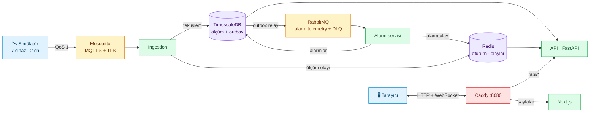
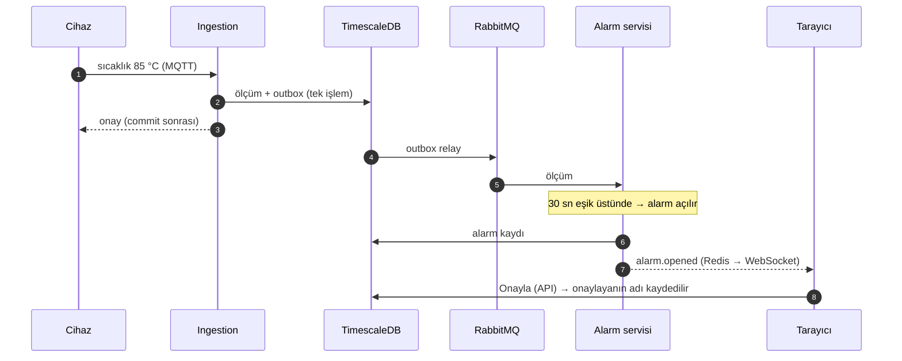
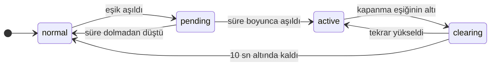
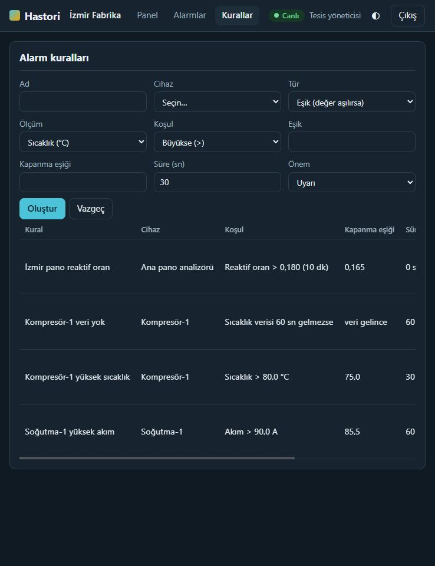
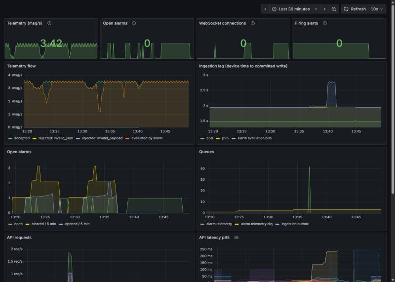

<div align="center">

# ⚡ Hastori

**Endüstriyel telemetri platformu** · canlı ölçüm, akıllı alarm, çok kiracılı API


 &nbsp;


</div>

7 cihaz her 2 saniyede ölçüm yayınlar; Hastori bunları saklar, kurallara göre alarm üretir ve
tarayıcıya **sayfayı yenilemeden** canlı gösterir. Arayüz Türkçe, kod ve belgeler İngilizce.

## ✨ Neler var

| | |
|---|---|
| 📡 **Güvenli veri hattı** | MQTT 5 + TLS, cihaz başına kimlik ve ACL; mesaj ancak veritabanına yazıldıktan sonra onaylanır, outbox ile kayıp yok |
| 🚨 **Akıllı alarm** | eşik + süre + histerezis, reaktif enerji oranı, susan cihaz (`no_data`); yeniden başlatmada aynı sonuç |
| 🏢 **Çok kiracılı API** | JWT, 3 rol, tesis bazlı yalıtım (başka tesis = 404), yetki matrisi testli |
| 📈 **Canlı panel** | WebSocket ile akan grafik, günlük kWh, alarm onaylama, kural oluşturma, açık/koyu tema |
| 🔭 **Gözlemlenebilirlik** | Prometheus uyarı kuralları, hazır Grafana paneli, istek kimliği ile iz sürme |
| 🛡️ **Sertleştirilmiş geçit** | Caddy: hız sınırı, gövde sınırı, HSTS, `Host` denetimi; imajlar digest ile sabit |

## 🧭 Mimari



<details>
<summary><b>🔄 Bir arızanın alarma dönüşmesi</b></summary>



</details>

<details>
<summary><b>🚦 Alarmın durum makinesi</b></summary>



Onaylamak makinenin durumu değildir: onaylanmış alarm hâlâ aktiftir. Ayrıntı: [tasarım notları](docs/design-notes.md#alarm-service-day-2).

</details>

## 🚀 Hızlı başlangıç

Gerekenler: Docker + Compose, [uv](https://docs.astral.sh/uv/), Git. (`make` yoksa Windows için karşılıkları [docs/operations.md](docs/operations.md) içinde.)

```bash
git clone <repo-url> hastori && cd hastori
make up         # .env, TLS, MQTT kullanıcıları, tüm servisler → http://127.0.0.1:8080
make seed       # demo kurum: 2 tesis, 7 cihaz, 5 kullanıcı, 5 kural
make backfill   # 7 günlük sentetik geçmiş (enerji kartı boş kalmasın)
make simulate   # saha simülatörünü başlat
make fault DEVICE=izmir-komp-1 KIND=overheat   # 30 sn sonra kritik alarm açılır
```

Sonra <http://127.0.0.1:8080> adresini aç. Giriş sayfasındaki **"İzleyici olarak gir"** ve
**"Tesis yöneticisi olarak gir"** düğmeleri parola istemez.

<details>
<summary><b>👤 Demo hesapları</b></summary>

| Rol | E-posta | Parola (`.env`) |
|---|---|---|
| Sistem yöneticisi | `admin@demo.hastori.local` | `SEED_SYSTEM_ADMIN_PASSWORD` |
| Tesis yöneticisi | `izmir.admin@…`, `antalya.admin@…` | `SEED_SITE_ADMIN_PASSWORD` |
| İzleyici | `izmir.izleyici@…`, `antalya.izleyici@…` | `SEED_VIEWER_PASSWORD` |

Varsayılan parolalar herkese açıktır. Yığını `127.0.0.1` dışına açmadan önce `make env-public` çalıştır.

</details>

### Hangi adreste ne var

| | Adres |
|---|---|
| 🖥️ Panel (sayfa + REST + WebSocket) | <http://127.0.0.1:8080> |
| 📘 Swagger | <http://127.0.0.1:8000/api/v1/docs> |
| 📊 Grafana — "Hastori pipeline" | <http://127.0.0.1:3001> (`admin`, parola `.env`'de) |
| 🔥 Prometheus | <http://127.0.0.1:9090> |

Tüm port listesi ve komutlar: [docs/operations.md](docs/operations.md).

## 🖼️ Ekran görüntüleri

| Alarmlar | Alarm ayrıntısı | Yeni kural |
|---|---|---|
|  |  |  |

| Açık tema | Grafana paneli |
|---|---|
|  |  |

> Görüntüler dar pencerede alındı (tek sütun düzeni). Enerji çubukları `make backfill` ile üretilen
> **sentetik** geçmiştir; gerçek ölçüm yalnızca yığının çalıştığı günlerdir.

## 🔐 Güvenlik özeti

- Cihaz parolası saklanmaz: `HMAC-SHA256(gizli, cihaz_id)`; her cihaz yalnızca kendi konusuna yazar.
- Erişim belirteci 15 dk ve bellekte; yenileme belirteci httpOnly çerez, her kullanımda döner, çalınma tespit edilir.
- Parola değişimi ya da pasife alma tüm oturumları hemen bitirir (`token_version`).
- WebSocket tek kullanımlık, 30 sn'lik biletle açılır; belirteç URL'ye girmez.
- Konteynerler yetkisiz kullanıcıyla, salt okunur dosya sistemiyle ve tüm capability'ler kapalı çalışır.

## 📚 Daha fazlası

| Belge | İçerik |
|---|---|
| [docs/design-notes.md](docs/design-notes.md) | Ingestion, alarm servisi, API, panel, gözlemlenebilirlik: nasıl ve neden |
| [docs/operations.md](docs/operations.md) | `make` hedefleri, adresler, API tablosu, yükseltme notları |
| [docs/testing.md](docs/testing.md) | Test türleri, Testcontainers, CI |
| [docs/known-limits.md](docs/known-limits.md) | Bilinen sınırlar, üretimde farklı yapacaklarım |
| [docs/design-risks.md](docs/design-risks.md) | Açık riskler |
| [docs/adr/](docs/adr/) | Kararlar: [TimescaleDB](docs/adr/0001-timescaledb-over-influxdb.md) · [RabbitMQ](docs/adr/0002-rabbitmq-over-kafka.md) · [WebSocket](docs/adr/0003-websocket-over-sse.md) |
| [docs/demo-script.md](docs/demo-script.md) | İki dakikalık gösteri akışı |

`seed/demo.yaml` tek doğruluk kaynağıdır: veritabanı tohumu, Mosquitto parola/ACL dosyaları ve
simülatörün cihaz listesi ondan üretilir.
